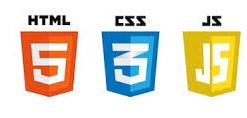

# Welcome to the Web Technologies Notes

 

 ::: tip Interesting Point
 These notes are created using a static site generator called [VuePress](https://vuepress.vuejs.org/),and hosted for free on Google's cloud infrastructure, [FireBase](https://firebase.google.com/).  Both Firebase and Vue are tools that demonstrate some of the latest Web Technologies.
 :::

 As the name suggests this unit will be introducing you to the technologies used to power web-based applications. I see the internet as a platform for delivering sophisticated applications. Furthermore, on a philosophical level, I see software applications as a means to solve problems. Herein lies why, the internet from a developers perspective, is such an exciting prospect. We get to solve problems (write applications) and distribute to the global platform that is the internet. Within this unit, you will be learning the foundation building blocks (HTML, CSS and JavaScript) that underly all web applications.

 # Delivery Structure

 This unit consists of two compulsory sessions, a Lecture (Tuesday, 11 - 12, Solent Lecture Theatre) and a 2-hour practical (see timetable). To complement this practical session, you will also have a 1 hour support session (see timetable).  
 
 
# Assessments

This unit consists of two assessments each worth and equal 50% of the final mark.

## TCA, Week starting **24th Feb**

[The mock TCA is now live](mock_tca.pdf), we will not be doing the mock TCA in class. The main TCA will take place on the week starting **24th Feb**. The TCA will be two hours in length and will take place in your usual practical session.  You will have access to the internet and course notes, which you may use freely. Within the TCA time period, you will be required to construct a simple one-page website. 

## Practical Assessment 1, Fri, 08th May, Before 1600

[Practical Assessment 1](assessment/assessment_1.md), will be a simple website demonstrating your JavaScript and HTML skills. The premise is to address some real-world problem through the implementation of a website. This assessment is due on  **Fri, 08th May, Before 1600**

## Session Schedule 
|      |           |
|------|-----------|
|    1  |   Workflow & Version Control        |
|    2  |   HTML, CSS & Content Ownership     |
|    3  |   Mobile Web Development        |
|    4  |   Creating Forms        |
|    5 |    Revision   |
|    6 |    **TCA WEEK**       |
|    7 |    Introduction to JavaScript       |
|    8 |    Introduction to SEO and Control Structures|
|    9 |    Accessing form Elements and Validation |
|    10 |   The latest CSS & HTML developments        |
|    11 |   Assessment Support        |

**Easter Holidays 06-Apr to 20-Apr**

|      |           |
|------|-----------|
|   12   |    Assessment Support       |
|   13  |       Assessment Support      |

