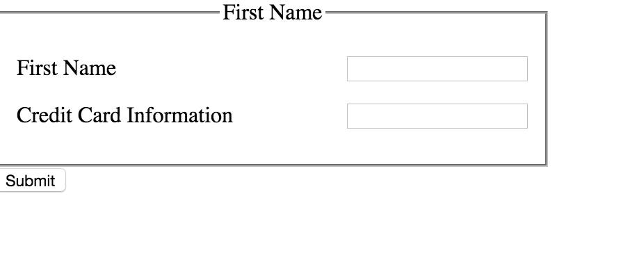

# Revision Notes

This week we will recap our previous weeks work. The aim is to make sure everyone is up-to-date for the TCA, which is next week.  


## Overarching Tips

Ensure you that you follow some basic coding rules: 

1. Indent your HTML tags relative to their parent: 
```html
<ul>
    <li> Get Shopping</li>
    <li> Go to Library</li>
    <li> DO WORK !!!</li>

</ul>
```

2. Validate your [HTML](https://validator.w3.org/#validate_by_input)

3. Make sure you comment when closing `div's`

```html
<div id="wrapper">

    <div class="section">
    
    </div>
    <!-- ./section -->

</div>
<!-- #/wrapper --> 
```


4. Where possible, use a snippet library such as [emmit](https://docs.emmet.io/), which is is pre-installed on most editors. It lets me do things like, type `html:5` then tab, to template a bias  

## [Week 1 - Introduction to HTML](../week_1/README.md) 

In week 1, I introduced HTML and our course workflow. You should note, you will not need to use Git and GitHub for the TCA. However, you will need to use it for the second assessment, that will be introduced after the TCA. 


## [Week 2 - Float Layout and CSS](../week_2/README.md)

- Week 2 is perhaps one of the most important weeks. It introduces to you the fundamentals of [float layout](/week_2/notes_practical.html#default-static-position-of-2-divs)

- You should ensure that you can layout `<div>`'s and other block level element side by side, using float

##  [Week 3 - Mobile Web Development](../week_3/README.md)

- Week three looked at responsive design, and this idea of responding to different device sizes.

- You should note, in the TCA, I am only going to be asking you to make your website responsive as an advanced task. As such we will be taking a desktop first approach.  In the TCA, after you implement the desktop version, you will set a simple, single, `min-width` breakpoint:

```html
@media(max-width:500px) {
  body {
     background-color:yellow;
  }
```

## [Week 4 - Laying Out Forms](../week_4/README.md)

- You will need to ensure that you can lay out a form like the one below. [This is is simple if you follow my steps in the notes]



- [You will also need to make sure that you can add basic HTML5 form validation](/week_4/notes_practical.html#html5-form-validation)


