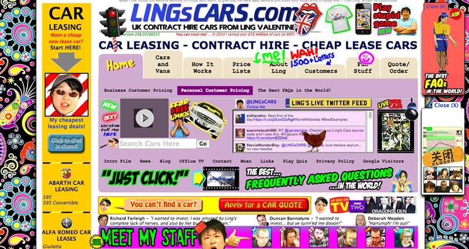
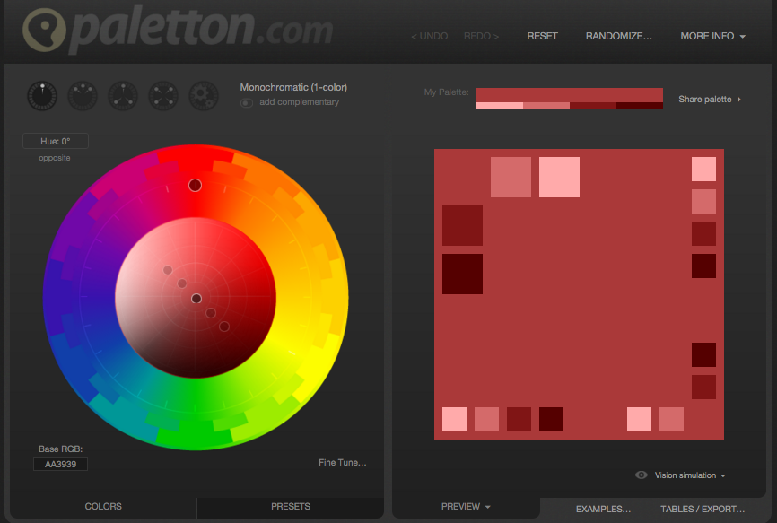

# Website Design Choices

## Picking a Colour Scheme For Your Website 

* You're making a website for humans, choosing the right colour scheme can have a huge effect on user engagement. Choose badly and people will not spend very long on your site

* Sometimes, visually awkward colours can work, but most of the time this is not the case:

>> [http://www.lingscars.com/](http://www.lingscars.com)

* Even though we're not marking your assessments based on your colour choices, you should still aim to make an aesthetically pleasing portfolio piece 

### How to find Colours That Work Well Together

[http://paletton.com/](http://paletton.com) allows you to pick a primary color and find further colours that work well together according to classical colour theories:

# Wireframe Mock Up's

It's tempting to jump straight in and start experimenting with HTML, designing the form as we go along. However, making design tweaks and experimenting with different layouts using HTML and CSS is time consuming.

* Therefore, it's common practice to plan the layout of HTML pages using a wire frame. A wire frame allows us to focus purely on the layout of our pages, filtering out the finer more time consuming design choices. 

Wire frames can be created:

* By Hand
* Using a drawing tool such as photoshop
* Using one of the many online wire framing tools

##### You'll need to create low fidelity wireframes for your assignment 