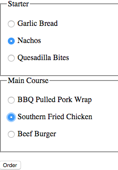

# Form Validation 

We've already validated forms using HTML5, however older browsers don't support this functionality. Therefore, many web application use JavaScript form validation as a fall back measure. **You'll need to do this for assessment2!!!** 

### Why validate forms using javaScript

- User input can't be trusted
- javaScript validates the user input before it's sent to the web server
- This makes forms quicker to use as the page does not have to reload for each error
- It also reduces server load


# Basic javaScript Form Validation

Using javascript to validate web form entries **before** that information is sent to the server is an effective way to maintain data integrity. 

In order to perform basic form validation we need to introduce a few new concepts.    

- Listening For A Form Submission Event 
- Accessing form controls
- Hiding and Displaying Error Messages
- Preventing a form submission

We will explore the above ideas below.


## Listening For A Form Submission Event 
Hopefully, you remember that a powerful feature of javaScript is the ability to react to events. A very useful event for form validation is to listen to a submission event. We do this by implement the `submit` event listener.

```javascript 
	 //add event listener to a form with a id of ourForm 
    var myForm = document.getElementById("ourForm");
    //the validateForm function will be called when the form submits 
    myForm.addEventListener("submit", validateForm);
```

Above, we call the function validateForm when the form with an id of `ourForm` is submitted. We can process the form and validate it, in order to do this 


## Accessing Form Text Fields 

In-order to validate a form we need to actually access its values.

Note, we have already introduced, perhaps a little early, the concept of how to loop through [radio/check boxes]('../week_8/notes_practical.html#loops-in-javascript'). In this section, at how to access `<inputs>`

 Consider the following simple form:

```html
<!doctype html>
<html>
    <head>

    </head>
    <body>
        <form id="demoForm" action="results.html" method="get">
            <input type="text" name="userName" placeholder="enter name">
            <input type="submit" value="go">  
        </form>
    </body>
</html>    
```
Here's how we'd access the userName field, using javaScript:

```java
//get a reference to the form and save it in the var form 
var form = document.getElementById("demoForm");
//grab the value of userNameTextBox
form.userName.value;  // will equal the value entered into the text field usrName
```

**Note**, we reference the text fields `name` attribute (userName) in oder to get the value of the form field. 

## Checking if there is a value in  a text field 

**Above** we showed you how to accesses the value of a text field. Checking that the value is not empty is easy:

```java
	if(form.userName.value == ""){
  		//form field is blank take action 
	}
```
	

## Hiding and Displaying Error Messages

Hopefully, it's fairly obvious that having the ability to hide and display error messages would be useful for form validation. Below is an example on how to display and then hide a paragraph element.  

**html**

```html
<p id="errorName"> Required </p>  
```

**JavaScript**

```javascript
//hide p element 
document.getElementById("errorName").style.display = "none";
//display p element  
document.getElementById("errorName").style.display = "block";
```


## Preventing a Form Submitting 

A form is submitted to the server when the submit button is pressed. However, if there are errors in the form we want to prevent this from happening.  

In order to do this, we can access the submit button event and instruct it to prevent the default behaviour of submitting.  The instruction is placed in the `onSubmit` callback function. 

Assuming `validateForm` is  our callback function, below is how we'd prevent the form from submitting:

```javascript
function validateForm(event){
	  event.preventDefault();
}
```
Observe how we add the parameter `event` in the callback function. We can then prevent its default submission beaviour. 


# Simple form Validation Example
Let's tie together the form validation concepts with a very simple example.


>> html 

```html
<!doctype html>
<html>
    <head>
         <title> Our Form Validation Example </title>
         <script  type="text/javascript"  src="script/main.js"></script>
    </head>
    <body onload="main()">
        
        <form id="login">
            
            <p><input type="text"  name="userName" placeholder="name"></p>
            <p id="userNameRequiredError" style="display: none">  Required </p>
            <p><input type="password"  name="password" placeholder="password"></p>
            <p id="passwordRequiredError" style="display: none">  Required </p>    
            <input type="submit">       
        </form>
        
    </body>
</html> 

```

>> javascript 

```javascript

 //onload callback function
 function main() {
    
    console.log("in main function");
    var myForm  = document.getElementById("login");
    myForm.addEventListener("submit",validateForm);
  }
  
  //validate callback function 
  function validateForm(event) {
    var formValid = true;
    var myForm = document.getElementById("login"); 
    
    if (myForm.userName.value == "") {
        formValid = false;
        //display error message 
        document.getElementById("userNameRequiredError").style.display = "block";
        //stop form from submitting
        event.preventDefault();
    } else {
        
         document.getElementById("userNameRequiredError").style.display = "none";
    }
    
    if (myForm.password.value == "") {
        formValid = false;
        //display error message 
        document.getElementById("passwordRequiredError").style.display = "block";
        //stop form from submitting
        event.preventDefault();
    } else {
        
         document.getElementById("passwordRequiredError").style.display = "none";
    }
     
  }
```   

# Accessing other form controls 

## Accessing a Radio boxes

You've already seen how to access the value of form text inputs, we can use the exact same technique to access the selected value of a radio box. 

```html
        <form id="orderForm">
            <fieldset>
                <legend>Starter</legend>
                <p><input type="radio" name="starter" value="bread" data-price = "1" > Garlic Bread</p>
                <p><input type="radio" name="starter" value="nachos" data-price = "2"> Nachos<p>
                <p><input type="radio" name="starter" value="quesadilla" data-price = "3"> Quesadilla Bites<p>
            </fieldset>
            <fieldset>
                <legend>Main Course</legend>
                <p><input type="radio" name="main" value="pork"> BBQ Pulled Pork Wrap</p>
                <p><input type="radio" name="main" value="chicken"> Southern Fried Chicken</p>
                <p></p><input type="radio" name="main" value="burger"> Beef Burger </p>
            </fieldset>
        </form> 
```



```javascript

var orderForm = document.getElementById("orderForm")
var starter = orderForm.starter.value;
var main = orderForm.main.value;
console.log(starter);  //will output nachos
console.log(main); // will output chicken

```
  
## Accessing Check Boxes

Given that a checkbox has multiple inputs and potentially multiple selections, we can't just access the selected values like we would for a single form input element such as a radio box or text input. As such, accessing the selected values of check boxes is a little bit more involved. 


Consider the following form:

```html
	<form  id="carRental">
            <p>Extra Car Cleaning Services?</p>    
            <p><input type="checkbox" name="extras" value="wheelCleaning"> Wheel cleaning (£3) </p>
            <p><input type="checkbox" name="extras" value="rustProtection">  Rust protection (£2) </p>
            <p><input type="checkbox" name="extras" value="airFreshner">  Air freshener (£1) </p>
    </form>
```

>> HTML


Below is how we would access each of the checkbox inputs values. 

```javascript

	 var form  = document.getElementById("carRental");
    
     for(var i = 0; i < form.extras.length; i++) {
         if (form.extras[i].checked){
            //this block of code is executed 
            console.log("You selected" + form.extras[i].value);  
         }
     }

```

In the above example, we loop through our checkbox group and simply print out the **value** attribute if the checkbox has been selected. 


**Note**  `form.extras.length` returns the number of elements in our checkbox group, in this case it would be `3`. 


## Encoding information into elements 


```html

<form  id="carCleaning">
            <p>Extra Car Cleaning Services?</p>    
            <p><input type="checkbox" name="extras" value="wheelCleaning"> Wheel cleaning (£3) </p>
            <p><input type="checkbox" name="extras" value="rustProtection">  Rust protection (£2) </p>
            <p><input type="checkbox" name="extras" value="airFreshner">  Air freshener (£1) </p>
</form>


```
Consider the above form example again, one of the challenges we have is that we don't have much descriptive information regarding each element in our checkbox group.  `document.getElementById("carRental").extras[1].value()` would return `wheelCleaning` but what if we wanted information about the price, or even a more human readable value?

### The data attribute

The data attribute allows us to add further descriptive information to a html element it's prefixed with 'data-' and the postfix must be lower case. We can then access value using the javaScript dataSet attribute. 

There are a few conventions that we must follow:

* Separate words for the dataset attribute must be separated using a `-`. e.g.  data-human-desc
* When we reference the data-attribute in javaScript we use camel case e.g. `form.extras[0].dataset.humanDesc `
<div id="example"> </div>

```html
....
<form  id="carCleaning">
            <p>Extra Car Cleaning Services?</p>    
            <p><input type="checkbox" data-price="3" data-human-desc="Wheel Cleaning" name="extras" value="wheelCleaning"> Wheel cleaning (£3) </p>
            <p><input type="checkbox" data-price="3" data-human-desc="Rust Protection" name="extras" value="rustProtection">  Rust protection (£2) </p>
            <p><input type="checkbox"data-price="3" data-human-desc="Air Freshner" name="extras" value="airFreshner">  Air freshener (£1) </p>
</form>

...
```
<p id = "total"> </p>  

Given the above form we could, use the `onChangeEvent` and provide the user with real time updates

```javascript 
  function main() {
    
    var form = document.getElementById("carCleaning");
    form.addEventListener("change", formChanged);
  
  }
  
  
  function formChanged(event){
	 var total = 0; 
     var choices  = ""
     
     
     
     for(var i = 0; i < form.extras.length; i++) {
        
         if (form.extras[i].checked){
            //convert the data attribute value from a string to a int
            itemPrice = parseInt(form.extras[i].dataset.price );
            //update total 
            total = total + itemPrice;
            //concatinate the new choice to our choices string 
            choices = choices + "<p>" + form.extras[i].dataset.humanDesc   +  "<p>")
         }
     }
       
        //update the display 
        document.getElementById("choices").innerHTML =    choices; 
        document.getElementById("price").innerHTML = itemPrice;
   }
```


  

 