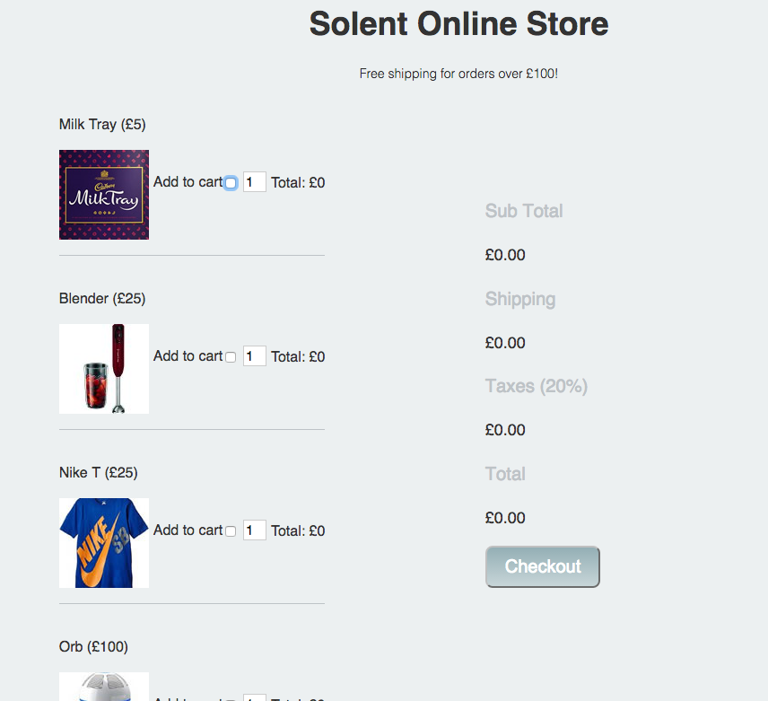

# Practical 

## Task 1 - Form Validation

The idea of this exercise is to introduce how to perform basic form validation in an incremental fashion.  The process has been broken down into steps,  you'll tutor will demo straight the solution to each step after the allotted time. If you're not in the lesson the entire solution will be available in next weeks notes. 


## 1 Set up folder structure and blank files
Having an organised file structure is vitally important. Luckily, it's also very easy to achieve

Within a new folder create the following project structure:


## 2 Create a form  

Within index.html create a new form with the following `<input type="text"` fields:


|field name| 
|----------|
|name      | 
|age       | 
|location  |
|email     |
|phone_number|
|address_line_1|
|post_code| 

For the sake of this example let's assume all the fields are required. Beneath each input place a `<p>` element containing the error message to be displayed if the above input is not filled in. 

**Note** each `<p>` element should have a unique `id` attribute  e.g. 

```html
 <p id="errorName" style="display:none"> Required </p>  
```


## 3 Create the `<body>` `onload()` event 

1) Within the `<head>` of your  `index.html` page include your javaScript file. 

2) Add a `onload` attribute within your html file's `<body>` tag that calls the `main()` function within your javaScript file. 

3) Create a `main()`  function in your javaScript file and to test it's being called when you html file loads add `console.log("in main function")` in your `main()` function.

If all is good you should see "in main function" within the console tab in developer tools:


## 4 Add a `submit` event  to your form 
Add a submit event to your form that calls a function called `function validateForm(event)`. Within the function `validateForm` add the two lines:

```html
console.log("validating from");
event.preventDefault(event);
```
Press the submit button and check that validate form is printed to the console. 

## 5 Validate the Form On Submit 
Ok, we're nearly there, we just need to actually validate the form when it is submitted. The logic to perform this will be placed in the `validate_form` function. Below is the pseudo code. Pseudo code is a  informal language that allows us to design functionality of our programs. **Note**,
 you need to understand the pseudo code and write the equivalent javaScript
   
		function validate_form 
			
			Initialise form_valid to true
			if name empty
		        set form_valid to false 
		        display name error 
		        prevent form from submitting 
		    else 
		       set form form_valid to true 
		       hide name error
		    
		   if location empty
		        set form_valid to false 
		        display location error 
		        prevent form from submitting
		    else
		        set form form_valid to true
		        hide location error
		        
		   ... continue pattern for all other fields ...
		    
		  
Implement the above functionality using javaScript. 

## 7 Optional Advanced 

Research  [javaScript regular expressions](https://developer.mozilla.org/en/docs/Web/JavaScript/Guide/Regular_Expressions) and see if you can also check for a valid phone number and email.      


## Task 2 - Solent Stores

This task was set last week, however, very few people completed it. As such, I've rolled it voer

### Solent Stores - Shopping cart exercise

The purpose of this exercise is to extend/improve/finish the solent stores exercise from last week. Once this is done, please work on your assignment

### 1 Setup

[Download the project source file from here](https://learn.solent.ac.uk/pluginfile.php/1608307/mod_resource/content/1/shopping_cart_exercise.zip?forcedownload=1#).  Open up index.html in your browser, you should be presented with the following website:



### 2  Add a data attribute to hold the price of each product

If you take a look at your source code for index.html you'll see that each product has a checkbox for the add to cart functionality.  Heres the one for our blender:

```html
    <input type="checkbox" name="product" value="blender">
```

[At the a data attribute to hold the ](https://sirus21.gitbooks.io/internet_technology_block_2/content/session17/enconding_information_into_elements.html) of each item. For example, our blender input would become:

```html
     <input type="checkbox" name="product" data-price = "25" value="blender">
```

### 3 Our first bit of javaScript

Within index.html, notice how we've included an external javaScript file and also added a `onLoad` event that calls a `main()` function.

1. Open up `script/main.js` 
2. Within `main.js` add an event listener that fires the `formChangedFunction`
3. Check that the message is output to the console when the form changes

### 4 Working out the main totals and shipping costs

1. Within `main.js` `formChangeFunction` create the following variables:

```javascript
    var form = document.getElementById("productForm"); 
    var subTotal = 0;
    var shipping = 0;
    var taxes = 0;
    var total = 0;
```

1. Next, within `formChangedFunction` Create a for loop that loops through the `product` check list, if a product has been checked you should cast the `price` to a number and add it to the subtotal. This is very similar to our the example in the notes.  

```javascript
    numberTotal =  parseInt(form.product[i].dataset.price);
    subTotal = subTotal +  numberTotal;
```

> > how to access the price from within the loop

Note, this is very similar to the in class example.

1. After the loop, check to see if the `subTotal` is less than £100. If this is the case, set `shipping = £10`  
2. Set the variable `taxes =  20% of subTotal`
3. Set the variable `total = subTotal + taxes + shipping`
4. Set the inner HTML of each section in the summary table = to your new variable values:

```javascript
document.getElementById("sub-total").innerHTML =  "£" + subTotal;
document.getElementById("shipping").innerHTML =  "£" + shipping;
document.getElementById("taxes").innerHTML =  "£" + taxes;
document.getElementById("total").innerHTML = "£" + total;
```

```
5 Product totals and multiple items
```

Implement the functionality to allow the amount of each product to be increased. The total for each product should be displayed.   This is tricky, but let's take the blender as an example and consider its related elements:

```html
<input data-price="25" type="checkbox" name="product" value="blender">  
<input type="number"  value="1" name="blender-quantity"> 
<p>Total: <span  id="blender-total"> £0 </span> </p>
```

This naming convention is consistent for all the products, your solution will take advantage of this.

### 6 Add real time form validation

The quantity box should go red if a number is entered below 0 or above 100.


### 7 Add a order summary

Above the checkout button add a order summary. This should be a list of items that have been selected in human readable form. It should be updated in real-time. To achieve this you'll need to add a desc attribute to each of you of your check boxes:


    `<input type="checkbox" name="product" data-desc="Milk Tray" value="mt">`


